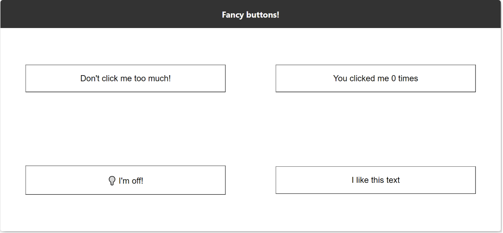

# Fancy Buttons

 This project is about creating buttons that will change their state when we interact with them! We will create four buttons. Each button will have a specific behavior:

- The `counter button` will keep track how many times we click on it.
- The `angry button` will change colour to get more red until it reaches a maximum threshold.
- The `light switch button` will turn on and off when clicked.
- The `text repeater button` will copy the text of the button over and over.

## The Goal

The main goals of this project are:

- using a state inside components
- passing down props to child components
- manage a state from a main component that trickles down to child components

## `npm start`

Runs the app in the development mode.\
Open [http://localhost:3000](http://localhost:3000) to view it in your browser.

The page will reload when you make changes.\
You may also see any lint errors in the console.

## Screenshots

- By the end of the module, our React App will look like this:
  
